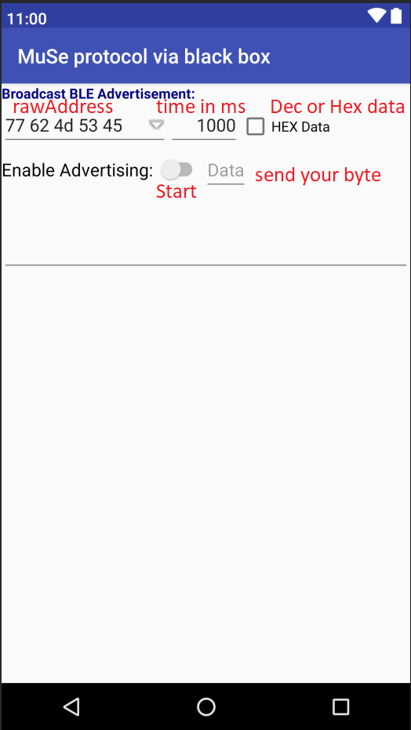

# MuSe Protocol
An application for broadcasting commands to MuSe, LoveSpouse, Leten toys. Full list of apps https://leten.zlmicro.com/index.php?g=App&m=Diyapp&a=updateAndroid

raw Address - The address of the toy, you can choose from the menu or enter your own.
time in ms - Time between sending data packets.
Dec or Hex data - Sending a command in a range of hex numbers is not used in applications, but there is such a possibility.
send your byte - Cyclically sending the same byte of data.

# Decoded MuSe protocol data
I opened the entire application and pulled out all the unique ids from the database. MuSe protocol is "decrypted".

[MuSe_bleCommand.txt](MuSe_bleCommand.txt)
# Folder base
While investigating the leten application, I looked into logcat and saw my current session. https://leten.zlmicro.com/index.php?g=App&m=Diyapp&userid=xxxxxxx&sessionid=xxxxxxxxxxxxxxxxxxxxxxxxxxxxxxxx
I downloaded the entire database and there are more than 1000 toys in it. And put it in the base folder. https://leten.zlmicro.com/index.php?g=App&m=Diyapp&a=getproductdetail&barcode=XXXX&userid=xxxxxxx&sessionid=xxxxxxxxxxxxxxxxxxxxxxxxxxxxxxxx

[base1000-9999.json](base/base1000-9999.json) Сoncatenated json
